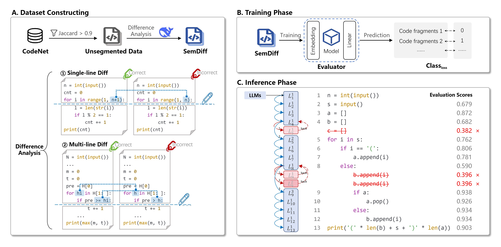

# SemGuard: Real-Time Semantic Evaluator for Correcting LLM-Generated Code


[](./LICENSE)

## ✨ Introduction

SemGuard is a novel code generation framework that integrates a lightweight semantic evaluator into the decoding process of large language models. It checks partial code during generation, detects semantic errors early, and rolls back to fix them, reducing mistakes more effectively than post-hoc correction methods, with low computational cost.




## 📚 Dataset
- **SemDiff** pairs semantically correct and incorrect code snippets and precisely identifies the specific location of semantic deviations, which are then used to train robust semantic evaluators.
- **SemDiff-Java** is the Java counterpart of SemDiff.

You can download the dataset from the [data](https://github.com/www-anonASE2025/SemGuard/tree/master/data) folder.
## 🤗 Model
You can download the dataset from the [model](https://github.com/www-anonASE2025/SemGuard/tree/master/model) folder.


## 🛠️ Preparations
The code requires some dependencies as specified in requirements.txt. Please follow the relevant libraries to install or run:
```bash
pip install -r requirements.txt
```
Install the transformers library from the source code (the current source code is developed from the original code of version 4.45.2):
```bash
cd transformers
pip install -e .
```
## 💽 Usage
## 1. Finetune Base Models
First, fine-tune the base model on the complete code of the SemDiff dataset by running the following code:
```bash
python train_base_model.py
```
## 2. Training Evaluator
Second, train the evaluator on the partial code of the SemDiff dataset by running the following code:
```bash
cd critic
bash run.sh
```
## 3. Generate Code
Third, control the decoding and generation of code with the help of an evaluator:
```bash
python generate_sem.py
```
## 4. Test Results
We use [Evalplus](https://github.com/evalplus/evalplus), [LiveCodeBench](https://github.com/LiveCodeBench/LiveCodeBench) for evaluation of MBPP, LiveCodeBench respectively.
Final, you can use the following code to test SemDiff.
```bash
cd metric
bash test_one_solution.sh
```
